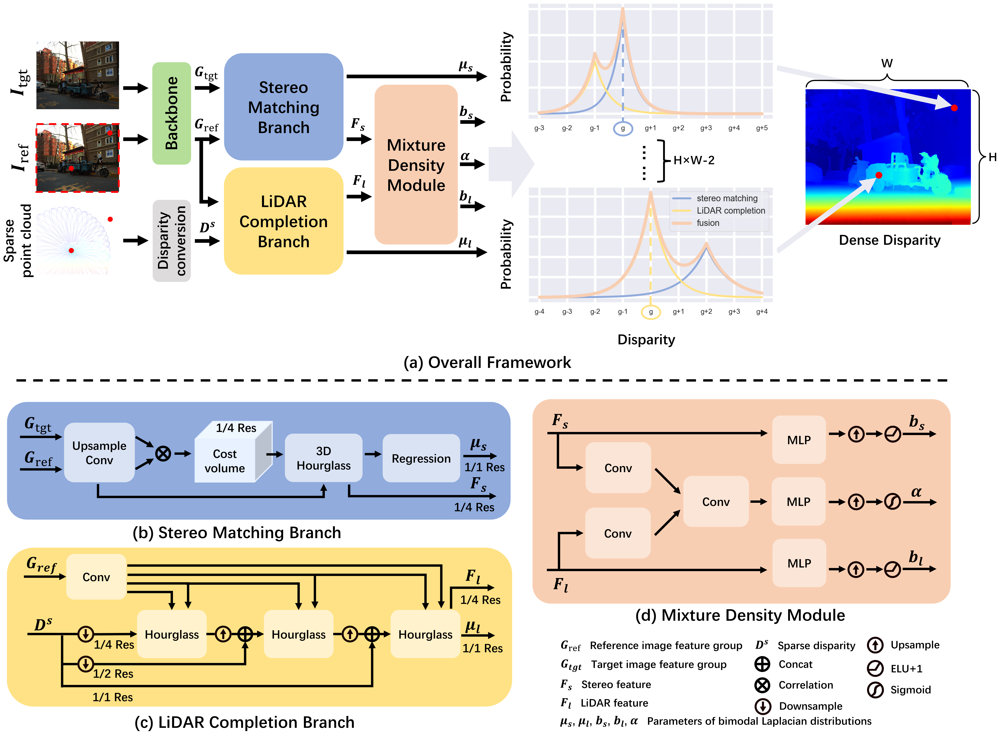

# LSMD-Net
This is an implementation (in PyTorch) for our paper "LSMD-Net: LiDAR-Stereo Fusion with Mixture Density Network for Depth Sensing", [ACCV 2022].

## Introduction
Depth sensing is critical to many computer vision applications but remains challenge to generate accurate dense information with single type sensor. The stereo camera sensor can provide dense depth prediction but underperforms in texture-less, repetitive and occlusion areas while the LiDAR sensor can generate accurate measurements but results in sparse map. We advocate to fuse LiDAR and stereo camera for accurate dense depth sensing. We consider the fusion of multiple sensors as a multimodal prediction problem. We propose a novel real-time end-to-end learning framework, dubbed as LSMD-Net to faithfully generate dense depth. The proposed method has dual-branch disparity predictor and predicts a bimodal Laplacian distribution over disparity at each pixel. This distribution has two modes which captures the information from two branches. Predictions from the branch with higher confidence is selected as the final disparity result at each specific pixel. Our fusion method can be applied for different type of LiDARs. Besides the existing dataset captured by conventional spinning LiDAR, we build a multiple sensor system with a non-repeating scanning LiDAR and a stereo camera and construct a depth prediction dataset with this system. 

<p align="center">
  
</p>

## Dependency
- Python 3.9
- Pytorch 1.11.0
- Pytorch-lightning 1.5.10

## Data Preparation
Download [KITTI Depth Completion](http://www.cvlibs.net/datasets/kitti/eval_depth.php?benchmark=depth_completion), [KITTI Stereo 2015](http://www.cvlibs.net/datasets/kitti/eval_scene_flow.php?benchmark=stereo), [KITTI RAW Data](https://www.cvlibs.net/datasets/kitti/raw_data.php) and our home-made [Livox-Stereo Dataset](https://pan.baidu.com/s/1EKopyRLRtJ-BhbLm5CmI0w) (Access code: 1GSB). Set the directory structure for data as follows:

```
./data/
      |--kitti/
              |--kitti_depth_completion/
                                       |--data_depth_annotated/
                                       |--data_depth_velodyne/
                                       |--depth_selection/                                    
              |--kitti_stereo/
                             |--data_scene_flow_2015/
              |--kitti_raw/
                          |--2011_09_26/
                          |--2011_09_28/
                          |--2011_09_29/
                          ... ...
              |--kitti_depth_completion_test.json
              |--kitti_stereo_test.json
              |--kitti_depth_completion_train.json
              |--kitti_depth_completion_val.json
              |--generate_depth_completion_train_val_test.py
              |--generate_stereo_test.py
     |--livox/
             |--data/
                    |--indoor/
                    |--outdoor/
             |--livox_test.json
             |--livox_train.json
             |--livox_val.json
             |--livox_gen_list.py
             |--sgm_remove_outliers.py           
```

## Training and Evaluation
* Training procedure
```
sh samples/single_train.sh
```
* Evalution procedure
```
sh samples/run_infer.sh
```

## Citation
If you find our work useful, please consider to cite our work.

## Acknowledgement
Part of the code is adopted from previous works: [CoEx](https://github.com/antabangun/coex) and [MSG-CHN](https://github.com/anglixjtu/msg_chn_wacv20).
